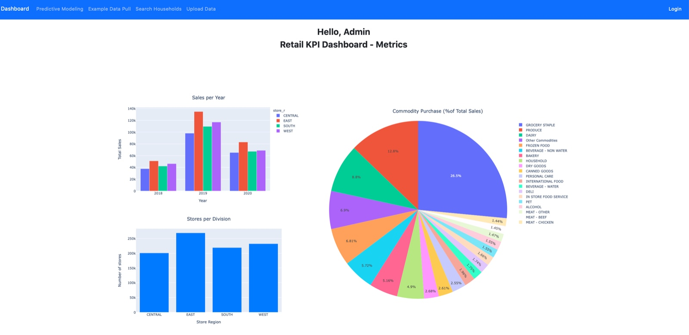

# KroDash

KroDash is a comprehensive web dashboard designed to facilitate efficient analysis of Kroger's retail data. Built with Flask and deployed on Heroku, this application integrates Azure PostgreSQL and SQLAlchemy to manage and process data seamlessly. It provides insightful visualizations and analytics to support informed decision-making and optimize retail operations.

## Dashboard Overview


## Features

- **Interactive Visualizations:** Dynamic charts and graphs to explore and analyze retail data.
- **Data Management:** Streamlined data processing with Azure PostgreSQL and SQLAlchemy.
- **User-Friendly Interface:** Responsive design for an optimal user experience.

## Technologies

- **Backend:** Flask for web development and SQLAlchemy for ORM.
- **Frontend:** HTML, CSS, and JavaScript for a dynamic user interface; Bootstrap for responsive design and styling.
- **Deployment:** Hosted on Heroku with data stored in Azure PostgreSQL.

## Installation
>**Note:** To run this repository, you need to have PostgreSQL installed on your local machine or use a cloud-based PostgreSQL service such as Heroku Postgres, Amazon RDS, Google Cloud SQL, or Azure Database for PostgreSQL. This project specifically uses Azure Database for PostgreSQL. Ensure PostgreSQL is properly set up and accessible, then update the project's configuration file with the appropriate database connection details.

Follow these steps to set up KroDash on your local machine:

**1. Clone the repository to your local machine using Git:**
```bash
git clone https://github.com/yourusername/KroDash.git
```

**2. Navigate into the project directory:**
```bash
cd KroDash
```

**3. Install the Python dependencies with:**
```bash
pip install -r requirements.txt
```

**4. Start the application with:**
```bash
flask run
```

Finally, navigate to:  **http://127.0.0.1:5000/**
